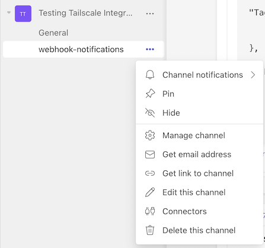
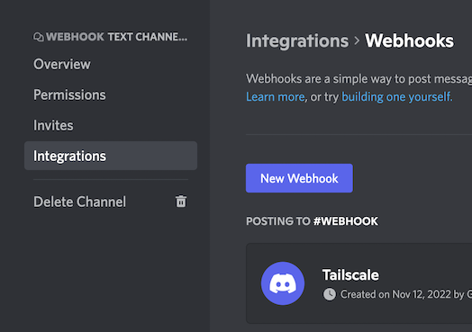

# Tailscale Webhook Adapter

A simple service to receive incoming [webhook notifications from Tailscale](https://tailscale.com/kb/1213/webhooks/)
and reformat to be suitable for several popular services including:
- [Microsoft Teams](https://www.microsoft.com/en-us/microsoft-teams/group-chat-software)
- [Discord Forums](https://discord.com/)

----

## Tailscale Setup
Follow the instructions to [setup webhook notifications](https://tailscale.com/kb/1213/webhooks/),
and store the Secret as an environment variable named `TS_WEBHOOK_SECRET` for this service.

----

## Microsoft Teams
To forward notifications to Microsoft Teams, create a chanel within the destination
Team and choose Connectors. Ann an *Incoming Webhook*, and store the URL as an
environment variable named `TEAMS_WEBHOOK_URL` for this service.

If no `TEAMS_WEBHOOK_URL` variable has been set, the Microsoft Teams delivery will be skipped.

----

## Discord
Webhook notifications can only be delivered to Discord Forum channels, which are only
available on Servers which have been set to Community mode.

After creating a Forum channel, choose *Integrations* > *Webhooks*. Store the URL
as an environment variable named `DISCORD_WEBHOOK_URL` for this service.

If no `DISCORD_WEBHOOK_URL` variable has been set, the Discord delivery will be skipped.
